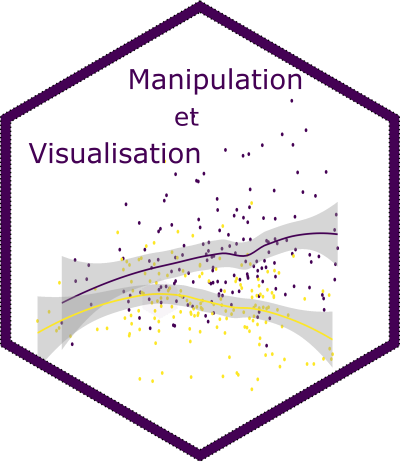
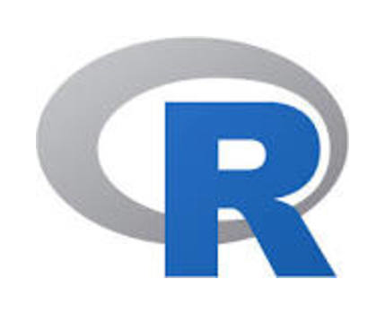
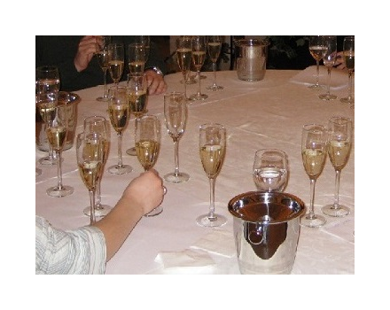

```{r setup_teaching, include=FALSE}
knitr::opts_chunk$set(echo = TRUE, cache = TRUE)
library(leaflet)
library(tidyverse)
library(ggplot2)
```


## L'équipe

Les formateurs sont des enseignants chercheurs d'Agrocampus Ouest impliqués dans la communauté R. Les formateurs sont des enseignants chercheurs d'Agrocampus Ouest impliqués dans la communauté R. Les formateurs sont des enseignants chercheurs d'Agrocampus Ouest impliqués dans la communauté R. Les formateurs sont des enseignants chercheurs d'Agrocampus Ouest impliqués dans la communauté R. Les formateurs sont des enseignants chercheurs d'Agrocampus Ouest impliqués dans la communauté R. Les formateurs sont des enseignants chercheurs d'Agrocampus Ouest impliqués dans la communauté R. Les formateurs sont des enseignants chercheurs d'Agrocampus Ouest impliqués dans la communauté R. Les formateurs sont des enseignants chercheurs d'Agrocampus Ouest impliqués dans la communauté R. Les formateurs sont des enseignants chercheurs d'Agrocampus Ouest impliqués dans la communauté R. Les formateurs sont des enseignants chercheurs d'Agrocampus Ouest impliqués dans la communauté R. Les formateurs sont des enseignants chercheurs d'Agrocampus Ouest impliqués dans la communauté R. Les formateurs sont des enseignants chercheurs d'Agrocampus Ouest impliqués dans la communauté R. Les formateurs sont des enseignants chercheurs d'Agrocampus Ouest impliqués dans la communauté R. Les formateurs sont des enseignants chercheurs d'Agrocampus Ouest impliqués dans la communauté R. Les formateurs sont des enseignants chercheurs d'Agrocampus Ouest impliqués dans la communauté R. 


## Les formations


|  |  |  |  |
|:--------------:|:--------------:|:--------------:|:--------------:|
|[</img>  ](manipvisu.html) | |[</img>  ](add.html)|  [](senso.html)   |
| **Manipulation et**  \ **visualisation de données**  | **Modélisation statistique** | **Analyse de données** |  **Sensométrie** \ **avec R**|


## L'école

Les formations sont dispensées à Agrocampus Ouest, Rennes.

```{r, echo=FALSE}
df <- tibble(long = -1.71, lat = -48.114, name='ACO - Bat 24' )
m <- leaflet() %>%
     setView(lng =-1.71, lat = 48.114, zoom = 15)
m %>%
     addTiles()
```

